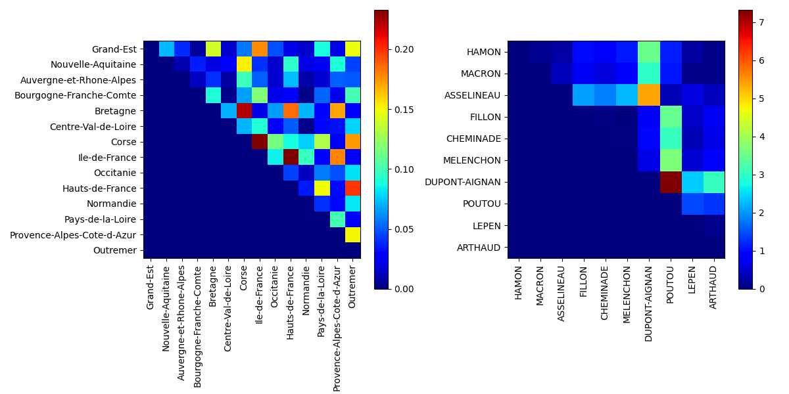
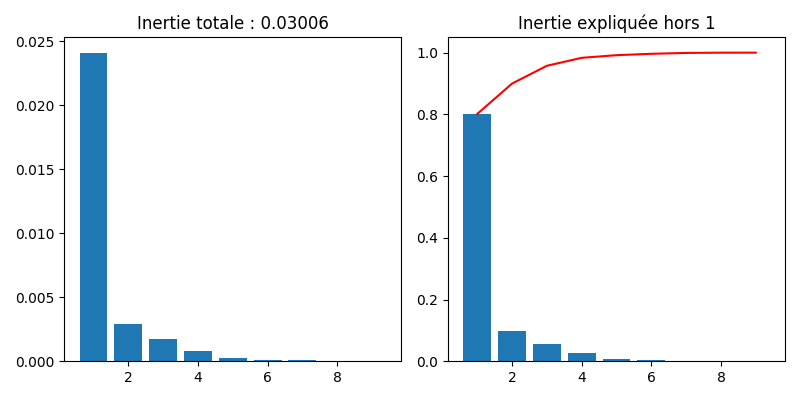
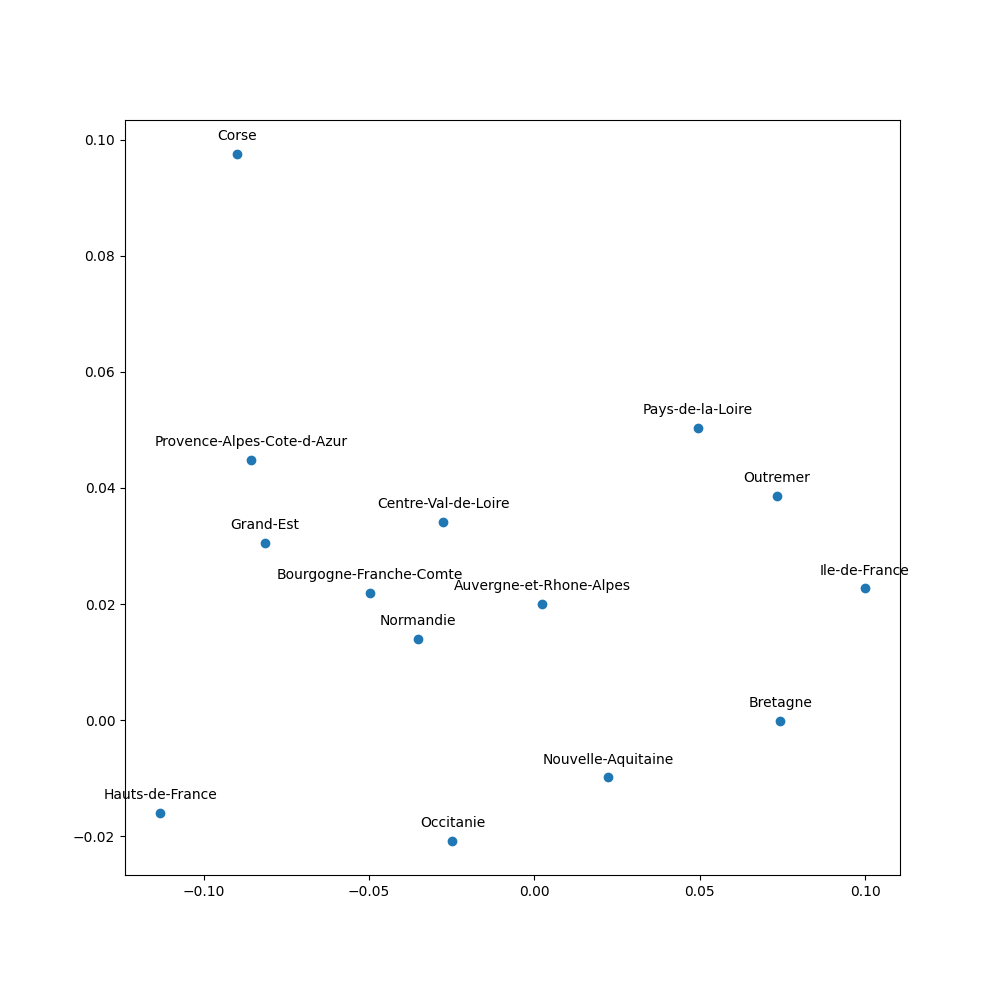
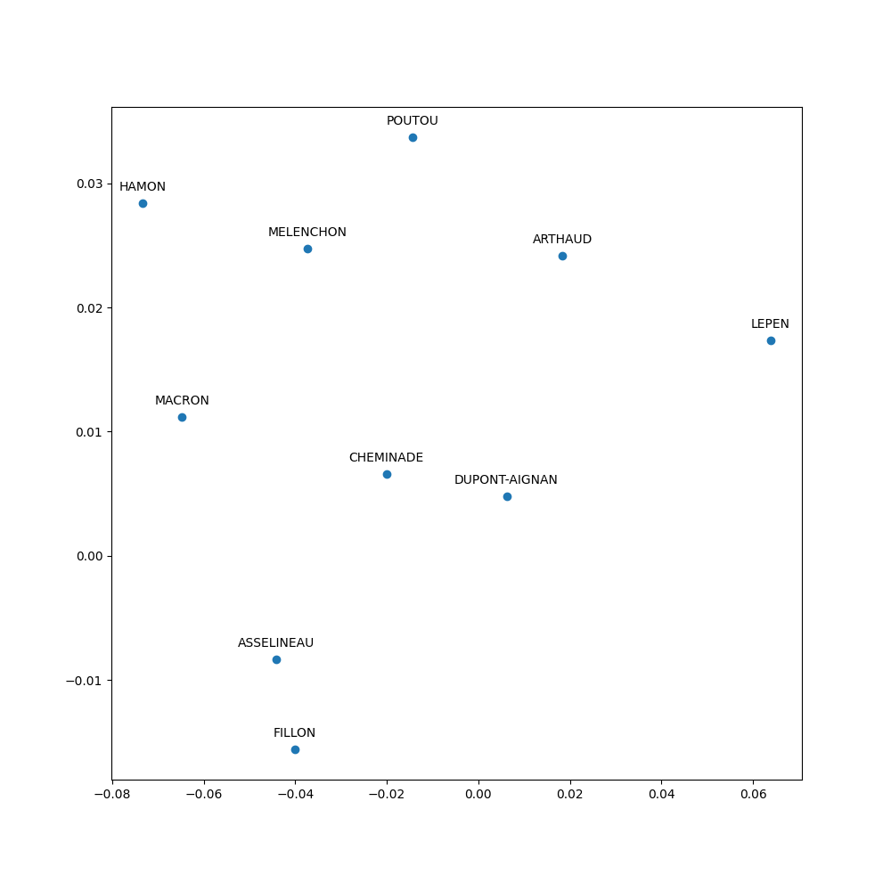

# Analyse Factorielle des correspondances

```{index} Analyse ; factorielle des correspondances
```
On cherche à expliquer la liaison entre deux variables qualitatives $X$ et $Y$, caractérisées par un ensemble de couples de modalités $(x_i,y_i)$. On note $x_1\cdots x_J$ et $y_1\cdots y_K$ les modalités distinctes de $X$ et $Y$ respectivement. 

Plus précisément, l'analyse factorielle des correspondances (AFC) vise à définir un modèle statistique permettant de fournir des paramètres dont la représentation graphique illustre les correspondances entre les modalités de ces variables. Dans sa version "analyse de données", l'AFC cherche à réduire la dimension des données en effectuant la décomposition factorielle des nuages de points associés aux profils lignes et aux profils colonnes du tableau de contingence croisant les modalités des deux variables (L'AFC est une double ACP sur les deux tableaux de profils). On aborde à la fin du chapitre une modélisation statistique de l'AFC, en supposant que les fréquences d'observation correspondent à l'observation d'une probabilité théorique, dont la distribution modélise le tableau de contingence des deux variables.


## Notations
Le tableau de contingence ${\bf T}$ entre les $X$ et $Y$, vu comme une matrice,  est défini par 

```{index} Tableau ; contingence
```
```{index} Contingence ; tableau
```

|          | $y_1$    | $\cdots$ | $y_k$    | $\cdots$ | $y_K$    | total    |
|----------|----------|----------|----------|----------|----------|----------|
| $x_1$    | $n_{11}$ | $\cdots$ | $n_{1k}$ | $\cdots$ | $n_{1K}$ | $n_{1.}$ |
| $\vdots$ | $\vdots$ | $\vdots$ | $\vdots$ | $\vdots$ | $\vdots$ | $\vdots$ |
| $x_j$    | $n_{j1}$ | $\cdots$ | $n_{jk}$ | $\cdots$ | $n_{jK}$ | $n_{j.}$ |
| $\vdots$ | $\vdots$ | $\vdots$ | $\vdots$ | $\vdots$ | $\vdots$ | $\vdots$ |
| $x_J$    | $n_{J1}$ | $\cdots$ | $n_{Jk}$ | $\cdots$ | $n_{JK}$ | $n_{J.}$ |
| total    | $n_{.1}$ | $\cdots$ | $n_{.k}$ | $\cdots$ | $n_{.K}$ | $n$      |


où $n_{j.}$ (resp $n_{.k}$ )sont les effectifs marginaux représentant le nombre de fois où $x_j$ (resp. $y_k$) apparaît, et $n_{jk}$ le nombre d'apparitions du couple $(x_j,y_k)$.

Les fréquences conjointes $f_{jk}=\frac{n_{jk}}{n}$ et les fréquences marginales sont stockées dans des vecteurs ${\bf g_J}=\begin{pmatrix}f_{1.}\ldots f_{J.} \end{pmatrix}^T$ et ${\bf g_K}=\begin{pmatrix}f_{.1}\ldots f_{.K} \end{pmatrix}^T$.


On note aussi ${\bf D_J}=diag\left (f_{1.}\ldots f_{J.}\right )$ et ${\bf D_K}=diag\left (f_{.1}\ldots f_{.K} \right )$.

Dans le tableau de contingence $\mathbf T$, on lit le $j^e$ profil ligne $[\frac{n_{j1}}{n_{j.}}\ldots \frac{n_{jK}}{n_{j.}}]$, considéré comme un vecteur de $\mathbb{R}^K$ et le $k^e$ profil colonne $[\frac{n_{1k}}{n_{.k}}\ldots \frac{n_{Jk}}{n_{.k}}]$ considéré comme un vecteur de $\mathbb{R}^J$. Ces profils sont rangés dans des matrices de profils lignes ${\bf A}\in\mathcal{M}_{KJ}(\mathbb{R})$ et de colonnes ${\bf B}\in\mathcal{M}_{JK}(\mathbb{R})$ définies par ${\bf A}=\frac{1}{n}{\bf T^TD_J^{-1}}\textrm{  et  } {\bf B}=\frac{1}{n}{\bf T D_K^{-1}}$


## Double ACP
L'analyse factorielle des correspondances peut être considérée comme le résultat d'une double ACP : 

- une effectuée sur les profils colonnes dans $\mathbb{R}^J$
- une effectuée sur les profils lignes dans $\mathbb{R}^K$

relativement à la métrique du $\chi^2$ de matrice ${\bf D_K^{-1}}$ pour l'analyse en lignes et ${\bf D_J^{-1}}$ pour l'analyse en colonnes.

Ainsi, par exemple, la distance entre deux modalités $x_l$ et $x_p$ de $X$ est donnée par :

$\Vert {\bf A_{.l}}-{\bf A_{.p}}\Vert^2_{{\bf D_K^{-1}}} = \displaystyle\sum_{i=1}^K\frac{1}{f_{.i}}\left (A_{i,l}-A_{i,p} \right )^2$

où ${\bf A_{.l}}$ est la $l^e$ colonne de ${\bf A}$. La métrique du $\chi^2$ introduit les inverses
des fréquences marginales des modalités de $Y$ comme pondérations des écarts
entre éléments de deux profils relatifs à $X$ (et réciproquement). Elle attribue
donc plus de poids aux écarts correspondants à des modalités de faible effectif
(rares) pour $Y$.

### ACP dans $\mathbb{R}^J$
L'ACP sur les profils colonnes est réalisée en recherchant les éléments propres de ${\bf BA}$, symétrique par rapport à la métrique ${\bf D_J^{-1}}$ et semi définie positive. On note $\bf U$ la matrice des vecteurs propres. Cette ACP fournit une représentation des modalités de $Y$, réalisée au moyen des lignes de la matrice des composantes principales ${\bf C_K}={\bf B^TD_J^{-1}U}$.

### ACP dans $\mathbb{R}^K$
L'ACP sur les profils lignes est réalisée en recherchant les éléments propres de ${\bf AB}$, symétrique par rapport à la métrique ${\bf D_K^{-1}}$ et semi définie positive. On note $\bf V$ la matrice des vecteurs propres. Cette ACP fournit une représentation des modalités de $X$, réalisée au moyen des lignes de la matrice des composantes principales ${\bf C_J}={\bf A^TD_K^{-1}V}$.

Puisque $\bf U$ contient les vecteurs propres de ${\bf BA}$ et $\bf V$ ceux de ${\bf AB}$, il suffit de réaliser en fait une seule ACP, les résultats de l'autre s'en déduisant simplement : si $\bf \Lambda$ est la matrice des valeurs propres (hors $\lambda_0=0$) communes aux deux ACP :

${\bf V} ={\bf AU\Lambda^{-\frac{1}{2}}}\textrm {  et  } {\bf U} ={\bf BV\Lambda^{-\frac{1}{2}}}$
Alors 

${\bf C_K}={\bf B^TD_J^{-1}U }= {\bf B^TD_J^{-1}BV\Lambda^{-\frac{1}{2}}} = {\bf D_K^{-1}ABV \Lambda^{-\frac{1}{2}}} =  {\bf D_K^{-1}V \Lambda^{\frac{1}{2}}}$
et

${\bf C_J}={\bf A^TD_K^{-1}V}= {\bf D_J^{-1}U \Lambda^{\frac{1}{2}}}$
d'où 

${\bf C_K}={\bf B^TC_J\Lambda^{-\frac{1}{2}}} \textrm{    et    } {\bf C_J}={\bf A^TC_K\Lambda^{-\frac{1}{2}}}$

```{prf:remark}
:class: dropdown
Soit deux matrices ${\bf A}\in\mathcal{M}_{KJ}(\mathbb{R)}$  et ${\bf B}\in\mathcal{M}_{JK}(\mathbb{R})$. Les valeurs propres non nulles de ${\bf AB}$ et ${\bf BA}$ sont identiques avec le même degré de multiplicité. De plus, si $\bf u$ est vecteur propre de ${\bf BA}$ associé à la valeur propre $\lambda\neq 0$, alors ${\bf v} = {\bf Au} $ est vecteur propre de ${\bf AB}$ associé à la même valeur
propre.
``` 

## Représentation graphique
La décomposition de $\mathbf T/n$ donne :

$$\frac{f_{jk}-f_{j.}f_{.k}}{f_{j.}f_{.k}} = \displaystyle\sum_{i=0}^{min(J-1,K-1)}\sqrt{\lambda_i}\frac{u^i_jv^i_k}{f_{j.}f_{.k}}$$

Cette quantité est appelée taux de liaison entre les modalités $j$ et $k$. En se limitant au rang $q$ on obtient pour chaque couple de modalité $(j,k)$ de $\mathbf T$ une approximation de son écart relatif à l'indépendance, comme produit scalaire des deux vecteurs $\frac{(\lambda_i)^{\frac{1}{4}}}{f_{j.}}u_j$ et $\frac{(\lambda_i)^{\frac{1}{4}}}{f_{.k}}v_k$, termes génériques des matrices ${\bf D_J^{-1}U\Lambda^{\frac{1}{4}}}$ et ${\bf D_K^{-1}V\Lambda^{\frac{1}{4}}}$.

La représentation graphique de ces vecteurs (par exemple avec $q=2$), appelée biplot, donne la correspondance entre les deux modalités $x_j$ et $y_k$. Lorsque ces deux modalités, éloignées de l'origine, sont
voisines (resp. opposées), leur produit scalaire est de valeur absolue importante ; leur cellule conjointe contribue alors fortement et de manière positive
(resp. négative) à la dépendance entre les deux variables. L'analyse factorielle des correspondances apparaît ainsi comme la meilleure reconstitution des fréquences $f_{jk}$, ou encore la meilleure représentation des écarts relatifs à l'indépendance. 

## Interprétation
Les qualités de représentation dans la dimension choisie et les contributions
des modalités de $X$ ou de $Y$ se déduisent facilement de celles de l'ACP. Ces
quantités sont utilisées à la fois pour choisir la dimension de l'analyse factorielle des correspondances  et pour interpréter ses résultats dans la dimension choisie.

### Inertie et test d'indépendance
En analyse en composantes principales centrée réduite, l'inertie totale du nuage de points est  égale au nombre de variables. En AFC,  l'inertie totale du nuage des profils lignes est  égale à l'inertie totale du nuage des profils colonnes, égale au $\chi^2$ d'indépendance entre les deux variables qualitatives.  
La valeur de l'inertie est donc un indicateur de la dispersion des nuages de points et une mesure de liaison entre les deux variables qualitatives,  appelée mesure d'écart à l'indépendance. 


### Interprétation des valeurs propres
Les valeurs propres des ACP renseignent sur la dispersion des nuages de profils lignes et colonnes : 
- Une valeur propre proche de 1 indique une dichotomie parfaite du tableau $\mathbf T$, qui peut être décomposé après reclassement des modalités en deux blocs distincts
- Plus généralement $p$ valeurs propres proches amènent à $k+1$ blocs distincts
- Si toutes les valeurs propres sont proches de 1, on aboutit à l'effet Guttman : il existe une correspondance entre chaque modalité ligne et une modalité colonne "associée". Avec une réorganisation des modalités, les effectifs importants se trouvent alors le long de la diagonale.


### Qualité globale
A $q$ fixé, la qualité globale de la représentation se mesure comme dans le cadre de l'ACP, comme le rapport entre les $q$ premières valeurs propres $\lambda_i$ et la somme sur tout le spectre. 

On montre que la qualité de la représentation dans la $i^e$ dimension s'écrit $\frac{n\lambda_i}{\chi^2}$

### Qualité de chaque modalité
Comme dans l'ACP également, la qualité d'une modalité de $X$ (resp. $Y$) se quantifie par le carré du cosinus de l'angle entre le vecteur représentant cette modalité dans $\mathbb{R}^K$ (resp. $\mathbb{R}^J$)  et sa projection orthogonale au sens de ${\bf D_K^{-1}}$ (resp. ${\bf D_J^{-1}}$) dans le sous-espace principal de dimension $q$. Ces cosinus se calculent très simplement en faisant le rapport des sommes appropriées des carrés des coordonnées extraites des lignes de ${\bf C_J}$ (resp. ${\bf C_K}$).

### Inertie expliquée
L'inertie totale du nuage des profils lignes (resp. colonnes) est égale à la somme de toutes les valeurs propres $\lambda_i$. La part due au $j^e$ profil ligne (resp. $k^e$ profil colonne) est $f_{j.}\displaystyle\sum_i \left (\mathbf{C_J}(ji) \right )^2$ (resp. $f_{.k}\displaystyle\sum_i \left (\mathbf{C_K}(ik) \right )^2$).

Les contributions à l'inertie selon chaque axe se calculent de la même manière, sans sommation sur $i$. Elles sont utilisées pour sélectionner les modalités les plus importantes (i.e. celles qui importent le plus dans la définition de la liaison entre $X$ et $Y$).

### Choix de q
Comme dans le cas de l'ACP, le choix de l'espace de représentation est important. On peut estimer $q$ comme en ACP (pourcentage de l'inertie expliquée, décroissance des valeurs propres), ou utiliser une approche probabiliste : si

$$\nu_{jk}^q = n f_{j.}f_{.k} + n\displaystyle\sum_{i=1}^q \sqrt{\lambda_i} u^i_jv^i_k$$

est l'estimation d'ordre $q$ de $n_{jk}$ alors sous certaines conditions ($n$ grand, modèle multinomial...), on montre que 

$\displaystyle\sum_{j=1}^J\displaystyle\sum_{k=1}^K\frac{\left (n_{jk}-\nu_{jk}^q \right )^2}{\nu_{jk}^q}\approx \displaystyle\sum_{i\geq q+1} \lambda_i$

suit approximativement une loi $\chi^2$ à $(J-q-1)(K-q-1)$ degrés de liberté. On peut donc retenir $q$ comme étant la plus petite dimension telle que cette quantité est inférieure à la valeur limite de cette loi. 

## Modèle statistique
On suppose que chaque fréquence $f_{jk}$ correspond à l'observation d'une probabilité   théorique $\pi_{jk}$ et on modélise donc $\bf T$ par la distribution correspondante. Le modèle décrivant cette distribution permet d'expliciter la probabilité.

### Modèle log linéaire
Souvent, le nombre $n$ est fixé a priori. La distribution conjointe des effectifs $n_{jk}$ est alors conditionnée par $n$ et est une loi multinomiale de paramètre $\pi_{jk}$ et d'espérance $n\pi_{jk}$.

Par définition, les variables $X$ et $Y$ sont indépendantes si $\pi_{jk}=\pi_{j.}\pi_{.k}$. Dans le cas contraire, on peut écrire 

$\pi_{jk} = \pi_{j.}\pi_{.k}\frac{\pi_{jk}}{\pi_{j.}\pi_{.k}}$

En passant au log, on linéarise en 

$ln\left (\pi_{jk}\right ) =  ln (\pi_{j.}) + ln (\pi_{.k})  + ln \left( \frac{\pi_{jk}}{\pi_{j.}\pi_{.k}}\right )$

Ce modèle est saturé car il comporte autant de paramètres que de données.  L'indépendance est vérifiée si le dernier terme de couplage est nul pour tout $(j,k)$. Les paramètres du modèle sont estimés en maximisant la log vraisemblance.


### Modèle de corrélation
Dans ce modèle, on écrit

$\pi_{jk} = \pi_{j.}\pi_{.k} + \displaystyle\sum_{i=1}^q \sqrt{\lambda_i} u^i_jv^i_k$

où ${\bf u^i}$ (resp. ${\bf v^i}$) sont les vecteurs propres de ${\bf BA}$ (resp. ${\bf AB}$),  $\lambda_i$ les valeurs propres associées (qui sont identiques pour les deux matrices), et $q\leq min(J-1,K-1)$. 

Les contraintes $\displaystyle\sum_{j=1}^J u^i_j =  \displaystyle\sum_{k=1}^K v^i_k = 0$  et ${\bf (u^i)^TD_J^{-1} u^l }= {\bf (v^i)^TD_K^{-1} v^l} = \delta_{il}$ (vecteurs propres orthonormés) permettent d'identifier les paramètres du modèle. 

Les estimations des paramètres $\pi_{j.}\pi_{.k} ,\lambda_i,u^i,v^i$ peuvent être réalisées par maximum de vraisemblance ou par moindres carrés.

## Exemple
On utilise ici des données open source du [gouvernement](https://www.data.gouv.fr/fr/posts/les-donnees-des-elections/), présentant le résultat du premier tour des élections présidentielles de 2017.


|    | Region              | HAMON  | MACRON  | ASSELINEAU | FILLON  | CHEMINADE |
|----|---------------------|--------|---------|------------|---------|-----------|
| 0  | Grand-Est           | 151296 | 615775  | 30223      | 586390  | 6078      |
| 1  | Nelle-Aquitaine     | 240175 | 851372  | 26667      | 602884  | 6264      |
| 2  | AURA                | 256620 | 1026255 | 41352      | 846252  | 7602      |
| 3  | Bourgogne-FC        | 87382  | 338187  | 14330      | 304387  | 2842      |
| 4  | Bretagne            | 180827 | 581076  | 13419      | 380815  | 3400      |
| 5  | Centre-Val-de-Loire | 83552  | 323724  | 12075      | 300324  | 2882      |
| 6  | Corse               | 5780   | 28528   | 965        | 39453   | 253       |
| 7  | Ile-de-France       | 430404 | 1612816 | 64406      | 1249770 | 9796      |
| 8  | Occitanie           | 216362 | 740037  | 28603      | 566045  | 5524      |
| 9  | Hauts-de-France     | 166640 | 630300  | 26043      | 521389  | 5688      |
| 10 | Normandie           | 113744 | 423075  | 14303      | 370188  | 3544      |
| 11 | Pays-de-la-Loire    | 143491 | 575832  | 15529      | 516428  | 3731      |
| 12 | PACA                | 113344 | 520909  | 25948      | 615455  | 4569      |
| 13 | Outremer            | 101948 | 389440  | 18725      | 314017  | 3425      |


|    | Region              | MELENCHON | LASSALLE | FILLON  | DUPONT-AIGNAN | POUTOU | LEPEN   | ARTHAUD |
|----|---------------------|-----------|----------|---------|---------------|--------|---------|---------|
| 0  | Grand-Est           | 484810    | 30508    | 586390  | 182200        | 34468  | 825600  | 24272   |
| 1  | Nelle-Aquitaine     | 703505    | 91915    | 602884  | 155600        | 49649  | 640228  | 21442   |
| 2  | AURA                | 805846    | 53282    | 846252  | 215951        | 43530  | 867874  | 24670   |
| 3  | Bourgogne-FC        | 276954    | 15843    | 304387  | 87263         | 18529  | 387658  | 11492   |
| 4  | Bretagne            | 385736    | 19097    | 380815  | 87928         | 27092  | 306644  | 14296   |
| 5  | Centre-Val-de-Loire | 252307    | 13570    | 300324  | 82060         | 16282  | 329470  | 11365   |
| 6  | Corse               | 21314     | 8711     | 39453   | 4462          | 1374   | 43041   | 495     |
| 7  | Ile-de-France       | 1225311   | 36358    | 1249770 | 226266        | 45715  | 708340  | 23592   |
| 8  | Occitanie           | 734223    | 75483    | 566045  | 135405        | 35219  | 762104  | 16777   |
| 9  | Hauts-de-France     | 633322    | 22411    | 521389  | 160722        | 33653  | 1003221 | 29194   |
| 10 | Normandie           | 362535    | 13900    | 370188  | 98957         | 23816  | 452702  | 15196   |
| 11 | Pays-de-la-Loire    | 403454    | 16988    | 516428  | 109842        | 26340  | 364267  | 16018   |
| 12 | PACA                | 515419    | 29551    | 615455  | 119025        | 21316  | 774791  | 10439   |
| 13 | Outremer            | 256149    | 7748     | 314017  | 29505         | 17599  | 213553  | 13180   |


On décide dans l'analyse d'enlever le candidat LASSALLE, dont les votes sont concentrés dans les Pyrenées et en Corse (et qui introduit un biais dans l'étude).

A partir de ce tableau de données $\bf T$, on calcule les tableaux de fréquences en lignes et en colonnes, ainsi que les profils ligne et colonne moyens. 
Comme en ACP, on s'intéresse à l'inertie du nuage de points, mais pour ce faire on utilise la distance du $\chi^2$. Avec cette métrique, la distance entre deux lignes (ou deux colonnes) ne dépend pas des poids respectifs des colonnes (ou lignes). Par exemple, les différents candidats obtiennent des scores très différents et l'usage de la métrique euclidienne aurait donné trop de poids aux candidats qui ont obtenu des scores élevés. De plus, la métrique du $\chi^2$ possède la propriété d'équivalence distributionnelle : si on regroupe deux modalités lignes (colonnes), les distances entre les profils-colonne (lignes), ou entre les autres profils-lignes (colonnes) restent inchangées.




On peut également calculer les taux de liaisons, définis pour deux individus $j$ et $k$ par $\frac{f_{jk}-f_{j.}f_{.k}}{f_{j.}f_{.k}}$. Par exemple, le taux de liaison entre HAMON et Grand-Est est égal à  -0.2003, tandis que le taux de liaison entre CHEMINADE et Nouvelle-Aquitaine est égal à 0.2068. Le taux de liaison s'interpréte comme suit : le score du candidat dans la région est 20\% moins élevé (ou 20.6\% plus élevé) que le score théorique que l'on observerait si les votes étaient indépendants des régions.

Notons que $f_{j.}f_{.k}$ représente le poids théorique de chaque case du tableau des fréquences. La somme de ces coefficients vaut 1. La moyenne de la série des taux de liaisons pondérée par les $f_{j.}f_{.k}$ est nulle. De même, la variance de cette série avec la même pondération vaut $\chi^2$, et ici est égale à 0.0301.

On réalise ensuite une AFC, par analyse spectrale des matrices $\bf X^T\bf X$ et $\bf X\bf X^T$, où $\bf X$ est la matrice de terme général $f_{jk}/\sqrt{f_{j.}f_{.k}}$.  

Le nombre de valeurs propres produites par la recherche des facteurs principaux est égal au minimum du nombre de lignes et du nombre de colonnes du tableau de contingence. La première valeur propre est systématiquement égale à 1, et n'est pas utilisée dans les résultats. Les autres valeurs propres sont des nombres positifs inférieurs à 1 et leur somme est égale à $\chi^2$.


 


On utilise alors les vecteurs propres (axes factoriels) pour analyser les données lignes et colonnes. Pour chaque analyse, on reporte (illustré ici sur l'analyse en lignes) : 
- La masse, qui rappelle les fréquences marginales des lignes c'est-à-dire le profil colonne moyen. Contrairement à l'ACP normée, dans laquelle chaque individu était affecté du même poids, les régions ont ici un poids dépendant de l'effectif total d'électeurs inscrits dans la région.
- La qualité qui indique les qualités de représentation des individus ligne sur les deux premiers axes factoriels : c'est la somme des carrés des composantes de chaque individu sur les 2 axes, normalisée par la somme des carrés des composantes sur tous les axes.
- La contribution de chaque individu à la formation de chaque axe factoriel


|    | Region              | Masse    | Coord1    | Coord2    | Qualité  | contrib1 | contrib2 |
|----|---------------------|----------|-----------|-----------|----------|----------|----------|
| 0  | Grand-Est           | 0.082561 | -0.081478 | 0.030469  | 0.033810 | 0.1031   | 0.05     |
| 1  | Nelle-Aquitaine     | 0.092573 | 0.022322  | -0.009848 | 0.002607 | 0.0129   | 0.1404   |
| 2  | AURA                | 0.116102 | 0.002463  | 0.020096  | 0.000032 | 0.0005   | 0.0074   |
| 3  | Bourgogne-FC        | 0.042922 | -0.049796 | 0.021913  | 0.012884 | 0.0203   | 0.0048   |
| 4  | Bretagne            | 0.055616 | 0.074398  | -0.000143 | 0.028325 | 0.0727   | 0.00599  |
| 5  | Centre-Val-de-Loire | 0.039694 | -0.027564 | 0.034140  | 0.003982 | 0.0057   | 0.026    |
| 6  | Corse               | 0.004089 | -0.089963 | 0.097463  | 0.036278 | 0.0061   | 0.0528   |
| 7  | Ile-de-France       | 0.157099 | 0.099907  | 0.022705  | 0.048773 | 0.3461   | 0.0099   |
| 8  | Occitanie           | 0.090960 | -0.024738 | -0.020736 | 0.003126 | 0.0066   | 0.2115   |
| 9  | Hauts-de-France     | 0.090114 | -0.113101 | -0.015944 | 0.061802 | 0.2215   | 0.1268   |
| 10 | Normandie           | 0.052720 | -0.035129 | 0.014011  | 0.006437 | 0.0116   | 0.0004   |
| 11 | Pays-de-la-Loire    | 0.061053 | 0.049348  | 0.050417  | 0.012418 | 0.0311   | 0.1115   |
| 12 | PACA                | 0.076388 | -0.085523 | 0.044826  | 0.035070 | 0.1061   | 0.1766   |
| 13 | Outremer            | 0.038108 | 0.073346  | 0.038647  | 0.026537 | 0.051    | 0.0222   |


On représente alors graphiquement les individus ligne et colonne sur le premier plan factoriel.

|  |  |
|------------------------------------------------------------|----------------------------------------------------------------|
| Individus ligne  | Individus colonne   |


On en déduit alors l'analyse suivante (ici proposée sur les candidats) :
- Premier axe : Le Pen représente 67\% de l'inertie de cet axe. Macron, à l'opposé en représente 19\%. Clairement, cet axe oppose Le Pen à Macron, mais les autres candidats "les plus importants" ont un score du même signe que celui de Macron.
- Fillon représente 63\% de son inertie et s'oppose à Hamon, Poutou et Mélenchon. Macron et Le Pen sont insignifiants sur cet axe. Cet axe représente l'opposition classique droite / gauche.
- Le Pen est placée assez loin de l'origine sur la représentation graphique:  l'inertie de la modalité Le Pen (54\%) est bien plus importante que sa masse (21\%). Dit autrement, les scores de Le Pen présentent une grande variabilité selon les régions, plus élevée que celle des scores de Macron (inertie 16\% pour une masse de 24,3\%) ou encore Mélenchon (inertie 5\%, inertie 19,8\%). Les électeurs de Le Pen, même s'ils sont plus nombreux que lors des scrutins précédents, restent inégalement répartis sur le territoire.
- Enfin, la première source de variation dans les votes est une opposition Le Pen / Macron, indépendante des oppositions  droite / gauche traditionnels.

