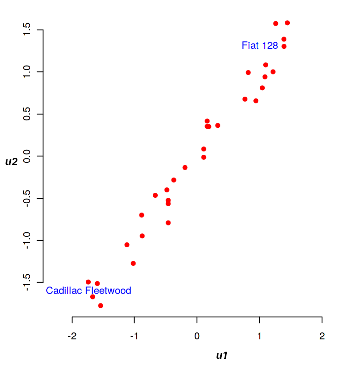

# Analyse canonique

On consid�re $n$ individus d�crits par deux ensembles de $p$ et $q$ variables quantitatives respectivement, o� on suppose sans perte de g�n�ralit� que $p\leq q$. L'analyse canonique se propose d'examiner les liens existants entre ces deux ensembles afin de savoir s'ils mesurent les m�mes propri�t�s. On se retreint ici au cas de deux groupes, la g�n�ralisation au cas de $g$ groupes quelconques donnant lieu � l'analyse canonique g�n�ralis�e.

Formellement on dispose donc de deux matrices ${\bf {\bf X_1}}\in\mathcal{M}_{n,p}(\mathbb{R})$ et ${\bf {\bf X_2}}\in\mathcal{M}_{n,q}(\mathbb{R})$, rassembl�es dans une matrice ${\bf X}=\left[{\bf {\bf X_1}}\mid {\bf {\bf X_2}} \right ]$. On supposera ${\bf {\bf X_1}}$ et ${\bf {\bf X_2}}$ de rang plein.

 L'�tude de la position g�om�trique relative des sous-espaces $Im({\bf {\bf X_1}})$ et $Im({\bf {\bf X_2}})$ permet d'analyser les deux ensembles de variables.

## Variables canoniques
On munit $\mathbb{R}^n$ d'une m�trique ${\bf D}$. 

### Principe
La recherche de variables canoniques consiste � rechercher ${\bf {\bf u_1}}\in Im({\bf {\bf X_1}}), \Vert {\bf {\bf u_1}}\Vert=1$ et  \mbox{${\bf v_1}\in Im({\bf {\bf X_2}})$}, $\Vert {\bf v_1}\Vert=1$ tels que l'angle $({\bf {\bf u_1}},{\bf v_1})$ est le plus faible. On recherche ensuite ${\bf {\bf u_2}}\in Im({\bf {\bf X_1}}), \Vert {\bf {\bf u_2}}\Vert=1$ orthogonal � ${\bf {\bf u_1}}$ au sens de ${\bf D}$, et ${\bf v_2}\in Im({\bf {\bf X_2}}), \Vert {\bf v_2}\Vert=1$ orthogonal � ${\bf v_1}$ au sens de ${\bf D}$ tels que l'angle $({\bf {\bf u_2}},{\bf v_2})$ soit minimal. On poursuit cette proc�dure it�rativement pour arriver au dernier couple $({\bf u_p},{\bf v_p})$.

### Formulation matricielle dans $\mathbb{R}^n$
On note ${\bf {\bf {\bf P_i}}},i\in[\![1,2]\!]$ la projection orthogonale (au sens de ${\bf D}$) sur $Im({\bf {\bf {\bf X_i}}})$. On sait alors que : $${\bf {\bf P_i}}={\bf {\bf X_i}}({\bf {\bf X_i}}^T{\bf D}{\bf {\bf X_i}})^{-1}{\bf {\bf X_i}}^T{\bf D}$$
La recherche de  ${\bf {\bf u_1}}$ et ${\bf v_1}$ am�ne � maximiser $cos({\bf {\bf u_1}},{\bf v_1})$. En utilisant le th�or�me suivant 

````{prf:theorem} Th�or�me de projection
Soit $L$ un sous-espace vectoriel de \R$^n$. �tant donn� un point ${\bf y}\in$\R$^n$, il existe un unique point ${\bf p}$ de $L$, appel� la projection orthogonale\index{projection orthogonale}
de ${\bf y}$ sur $L$, tel que $\norme{{\bf y}-{\bf p}}\leq \norme{{\bf y}-{\bf x}},\forall {\bf x}\in L$. Une condition n�cessaire et suffisante pour que ${\bf p}\in L$ soit la projection orthogonale de ${\bf y}$ sur $L$ est ${\bf y}-{\bf p}\in L^\bot$
````

On en d�duit que ${\bf v_1}$ doit �tre tel que ${\bf P_1}{\bf v_1}$ soit colin�aire � ${\bf {\bf u_1}}$. De m�me, ${\bf v_1}$ doit �tre le vecteur de $Im({\bf {\bf X_2}})$ le plus proche de ${\bf {\bf u_1}}$ (ou de ${\bf P_1}{\bf v_1}$ qui lui est colin�aire), donc ${\bf v_1}$ doit �tre colin�aire � ${\bf P_2}{\bf P_1}{\bf v_1}$. Le probl�me se ram�ne donc � la recherche des �l�ments propres de ${\bf P_2}{\bf P_1}$.


 Tout d'abord, les vecteurs propres de ${\bf P_2}{\bf P_1}$ sont dans $Im({\bf {\bf X_2}})$. En effet en multipliant � gauche ${\bf P_2}{\bf P_1}{\bf v_1}=\lambda_1{\bf v_1}$ par ${\bf P_2}$, et puisque ${\bf P_2^2}={\bf P_2}$ (projection), on a imm�diatement \mbox{${\bf P_2}{\bf P_1}{\bf v_1}=\lambda_1{\bf P_2}{\bf v_1}$} et donc ${\bf P_2}{\bf v_1}={\bf v_1}\in Im({\bf {\bf X_2}})$
 

 On montre ensuite que ${\bf P_2}{\bf P_1}$ est sym�trique (par rapport � ${\bf D}$). Pour cela, en fonction de la remarque pr�c�dente, il suffit de d�montrer que pour tout ${\bf x},{\bf y}\in Im({\bf {\bf X_2}})$ (sym�trie du produit scalaire engendr� par ${\bf D}$)
 $${\bf x}^T{\bf D}{\bf P_2}{\bf P_1}{\bf y} = ({\bf P_2}{\bf P_1}{\bf x})^T{\bf D}{\bf y}$$
 On a en effet :
 


 ${\bf x}^T{\bf D}{\bf P_2}{\bf P_1}{\bf y}$ =$({\bf P_2}{\bf x})^T{\bf D}{\bf P_1}{\bf y}$car ${\bf P_2}$ sym�trique

 =${\bf x}^T{\bf D}{\bf P_1}{\bf y}$&car ${\bf x}\in Im({\bf {\bf X_2}})$

 =$({\bf P_1}{\bf x})^T{\bf D}{\bf y}$car ${\bf P_1}$ sym�trique

 =$({\bf P_1}{\bf x})^T{\bf D}{\bf P_2}{\bf y}$car ${\bf y}\in Im({\bf {\bf X_2}})$

 =$({\bf P_2}{\bf P_1}{\bf x})^T{\bf D}{\bf y}$car ${\bf P_2}$ sym�trique
 

 ${\bf P_2}{\bf P_1}$ est donc sym�trique, r�elle, elle est donc diagonalisable. Elle poss�de au plus $min(p,q)$ valeurs propres non identiquement nulles, toutes positives car les ${\bf {\bf P_i}}$ sont des matrices semi d�finies positives.

 On recherche donc maintenant ${\bf v_1}$ tel que ${\bf P_2}{\bf P_1}{\bf v_1}=\lambda_1{\bf v_1}$. Il est imm�diat alors que ${\bf {\bf u_1}}$ est vecteur propre de ${\bf P_1}{\bf P_2}$ associ� � $\lambda_1$, qui repr�sente le carr� du cosinus de l'angle entre ${\bf v_1}$ et ${\bf {\bf u_1}}$ (donc $\lambda_1\leq 1$).\\
 Le cas $\lambda_1=1$ correspond � ${\bf {\bf u_1}}={\bf v_1}$ et sa multiplicit� donne la dimension de $Im({\bf {\bf X_1}})\bigcap Im({\bf {\bf X_2}})$. \\
 Les vecteurs propres associ�s � des valeurs propres nulles de rang inf�rieur � $q$ engendrent la partie de $Im({\bf {\bf X_2}})$ orthogonale � $Im({\bf {\bf X_1}})$.
En r�sum�, dans $\mathbb{R}^n$, les vecteurs propres ${\bf u_i},{\bf v_i}$ des matrices ${\bf P_1}{\bf P_2}$ et ${\bf P_2}{\bf P_1}$ v�rifient :

- ${\bf P_2}{\bf P_1}{\bf v_i}=\lambda_i {\bf v_i}$ et $\sqrt{\lambda_i}{\bf v_i} = {\bf P_2}{\bf u_i}$
- ${\bf P_1}{\bf P_2}{\bf u_i}=\lambda_i {\bf u_i}$ et $\sqrt{\lambda_i}{\bf u_i} = {\bf P_1}{\bf v_i}$
- $(\forall i\neq j)\quad {\bf v_i}^T{\bf D}{\bf v_j} = {\bf u_i}^T{\bf D}{\bf u_j}={\bf v_i}^T{\bf D}{\bf u_j}=0$


### Formulation matricielle dans les espaces des variables
D'apr�s la d�finition des sous-espaces image, il existe ${\bf a_i}\in\mathbb{R}^p,{\bf b_i}\in\mathbb{R}^q$ tels que  ${\bf u_i}={\bf {\bf X_1}}{\bf a_i}$ et ${\bf v_i}={\bf {\bf X_2}}{\bf b_i}$. Les ${\bf a_i}$ et ${\bf b_i}$ sont les facteurs canoniques qui se calculent par 

$${\bf P_1}{\bf P_2}{\bf u_i}=\lambda_i {\bf u_i} \Leftrightarrow {\bf P_1}{\bf P_2}{\bf X_1}{\bf a_i}=\lambda_i {\bf X_1} {\bf a_i}$$

 soit 

 $$({\bf X_1}({\bf X_1}^T{\bf D}{\bf X_1})^{-1}{\bf X_1}^T{\bf D})({\bf X_2}({\bf X_2}^T{\bf D}{\bf X_2})^{-1}{\bf X_2}^T{\bf D}){\bf X_1}{\bf a_i}=\lambda_i {\bf X_1} {\bf a_i}$$

 Or $Rg({\bf X_1})=p$ donc l'�quation se simplifie en

 $$(({\bf X_1}^T{\bf D}{\bf X_1})^{-1}{\bf X_1}^T{\bf D})({\bf X_2}({\bf X_2}^T{\bf D}{\bf X_2})^{-1}{\bf X_2}^T{\bf D}){\bf X_1}{\bf a_i}=\lambda_i {\bf a_i}$$

 et de m�me

 $$(({\bf X_2}^T{\bf D}{\bf X_2})^{-1}{\bf X_2}^T{\bf D})({\bf X_1}({\bf X_1}^T{\bf D}{\bf X_1})^{-1}{\bf X_1}^T{\bf D}){\bf X_2}{\bf b_i}=\lambda_i {\bf b_i}$$

 Si les variables sont centr�es (${\bf {\bf X_i}}^T{\bf D}{\bf 1} = 0$), les matrices ${\bf {\bf X_i}}^T{\bf D}{\bf X_j}$ s'interpr�tent comme des matrices de covariance que l'on note ${\bf V_{ij}} = {\bf {\bf X_i}}^T{\bf D}{\bf X_j}$ et les �quations des facteurs canoniques s'�crivent finalement

$ {\bf V_{11}^{-1}}{\bf V_{12}}{\bf V_{22}^{-1}}{\bf V_{21}}{\bf a_i}$=$\lambda_i {\bf a_i}$

$ {\bf V_{22}^{-1}}{\bf V_{21}}{\bf V_{11}^{-1}}{\bf V_{12}}{\bf b_i}$=$\lambda_i {\bf b_i}$

et les $\lambda_i$ sont les carr�s des coefficients de corr�lation canonique entre les variables canoniques. Si on impose que les variables canoniques soient de variance unit�, on normalise les facteurs par ${\bf a_i}^T{\bf V_{11}}{\bf a_i}=1$ et  ${\bf b_i}^T{\bf V_{22}}{\bf b_i}=1$, d'o�

$${\bf b_i}=\frac{1}{\sqrt{\lambda_i}}{\bf V_{22}^{-1}}{\bf V_{21}}{\bf a_i}\textrm{  et } {\bf a_i}=\frac{1}{\sqrt{\lambda_i}}{\bf V_{11}^{-1}}{\bf V_{12}}{\bf b_i}$$


## Repr�sentation graphique
### Repr�sentation des variables
On peut repr�senter indiff�remment les variables canoniques de $Im({\bf {\bf X_1}})$ ou $Im({\bf {\bf X_2}})$ : on repr�sente pour cela les colonnes de ${\bf X_1}$ et ${\bf X_2}$ en projection sur la base des ${\bf u_i}$ (resp ${\bf v_i}$).  

Par exemple, si l'on s'int�resse � la repr�sentation sur $Im({\bf {\bf X_1}})$,  la projection sur $Lin({\bf {\bf u_1}},{\bf {\bf u_2}})$ est appel�e cercle des corr�lations, car, si les colonnes de ${\bf X_1}$ et ${\bf X_2}$ sont norm�es par rapport � ${\bf D}$, les composantes sur la base des $({\bf u_i})$ sont les coefficients de corr�lation entre variables initiales et variables canoniques. En effet, si on note pour $k\in[\![1,p]\!]$ ${\bf X_{\bullet,k}}$ la $k^e$ colonne de ${\bf X_1}$ alors ${\bf X_{\bullet,k}}^T{\bf D}{\bf {\bf u_1}}={\bf X_{.k}}^T{\bf D}{\bf X_1}{\bf a_1}$. Le coefficient de corr�lation entre ${\bf X_{\bullet,k}}$ et ${\bf {\bf u_1}}$ est la $k^e$ composante de ${\bf V_{11}}{\bf a_1}$ car ${\bf X_{\bullet,k}}={\bf X_1}{\bm \delta_k}$, o� ${\bm \delta_k}\in\mathbb{R}^p$ est le vecteur nul sauf la $k^e$ composante qui vaut 1.

De m�me si on note pour $l\in[\![1,q]\!]$ ${\bf X_{\bullet,l}}$ la $l^e$ colonne de ${\bf X_2}$ alors ${\bf X_{\bullet,l}}^T{\bf D}{\bf {\bf u_1}}={\bm \delta_l^T}{\bf X_2}^T{\bf D}{\bf X_1}a_1$, et la corr�lation entre ${\bf X_{\bullet,l}}$ et ${\bf u_i}$ est la $l^e$ composante de ${\bf V_{21}}{\bf a_i}$ ou encore la $l^e$ composante de $\sqrt{\lambda_1}{\bf V_{22}}{\bf b_i}$.


### Repr�sentation des individus
L� encore, on peut repr�senter les individus selon les variables canoniques ${\bf u_i}$ ou ${\bf v_i}$. Dans le plan $Lin({\bf {\bf u_1}},{\bf {\bf u_2}})$, par exemple, les coordonn�es du $k^e$ point sont les $k^e$ composantes des variables canoniques ${\bf {\bf u_1}}$ et ${\bf {\bf u_2}}$. 

## Quelques r�flexions autour de l'analyse canonique
### Int�r�t th�orique
L'analyse canonique pr�sente un int�r�t th�orique certain car plusieurs m�thodes statistiques tr�s utilis�es en sont des cas particuliers. 

### Cas $q$=1
Si l'on cherche � expliquer $\mathbf{X_2}$  par $\mathbf{X_1}$ : 

- Si $p$=1, c'est un probl�me de r�gression lin�aire (chapitre \ref{ch:regression})
- Si $p>$1, c'est un probl�me de r�gression lin�aire multiple (chapitre \ref{ch:regression})
- Si  $\mathbf{X_1}$ est constitu� d'une ou plusieurs variables qualitatives, on aboutit � un mod�le d'analyse de la variance
- Si  $\mathbf{X_1}$ est constitu� de variables qualitatives et quantitatives, on aboutit � un mod�le d'analyse de la covariance

Dans tous ces cas, le probl�me est de maximiser le coefficient de corr�lation entre une variable quantitative et un ensemble de variables, c'est donc bien un probl�me d'analyse canonique.

### Cas g�n�ral

- L'analyse Factorielle Discriminante (cf. chapitre \ref{ch:AFD})  est le cas particulier de l'analyse canonique  pour lequel $\mathbf{X_1}$ d�crit un ensemble de variables quantitatives et $\mathbf{X_2}$ une variable qualitative
- L'Analyse Factorielle des correspondances (cf. chapitre \ref{ch:AFC}) est l'instantiation d'une analyse canonique dans laquelle $\mathbf{X_1}$  et $\mathbf{X_2}$ d�crivent les modalit�s d'une variable qualitative.


### Limites
L'analyse canonique d�crit les relations lin�aires existant entre deux ensembles de variables : les premi�res �tapes mettent en �vidence les directions de l'espace des variables selon lesquelles les deux ensembles sont les plus proches. Mais il est possible que les variables canoniques soient faiblement corr�l�es aux variables des tableaux $\mathbf{X_1}$  et $\mathbf{X_2}$, elles deviennent dans ce cas  difficilement interpr�tables. Les variables d'origine n'interviennent en effet pas dans les calculs de d�termination des composantes canoniques, seuls comptent les projecteurs sur les espaces engendr�s par ces variables.

## Exemple
On s'int�resse au jeu de donn�es mtcars\footnote{https://gist.github.com/seankross/a412dfbd88b3db70b74b}, qui d�crit 32 voitures � l'aide de 11 param�tres quantitatifs. Ces param�tres peuvent �tre class�s en deux cat�gories, l'une  ($\mathbf{X_1}$) relative � des performances de conduite (puissance, consommation, ...), l'autre  ($\mathbf{X_2}$) plus reli�e aux caract�ristiques de l'automobile (nombre de cylindres, nombre de carburateurs,...). L'objectif est de voir s'il existe un lien entre ces deux ensembles de variables.

La projection des individus (les voitures) dans le plan $\mathbf u_1,\mathbf u_2$ est donn�e dans la figure suivante. A gauche, la projection des individus dans ($\mathbf u_1,\mathbf u_2$), � droite la projection des variables sur le cercle des corr�lations. Les  variables de  $\mathbf{X_1}$ sont repr�sent�es en rouge, celles de  $\mathbf{X_2}$  en bleu




Ce plan identifie  deux extr�mes : les grandes voitures (en bas � gauche) et les petites  voitures (en haut � droite). La corr�lation des donn�es sur ce plan est de 0.98, une relation lin�aire semble donc �vidente entre ces deux groupes.

La projection des variables sur le cercle des corr�lations (figure \ref{F:CCA1}-(b)) montre  que toutes les variables sont expressives (pr�s du cercle). 


