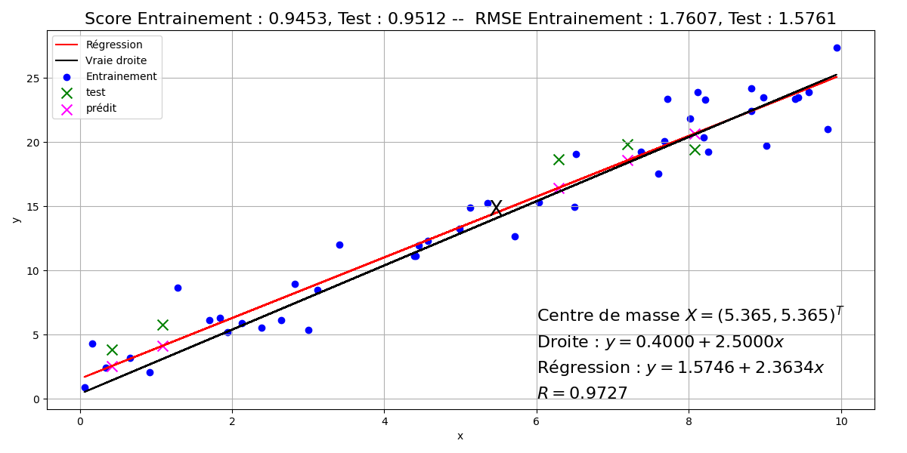
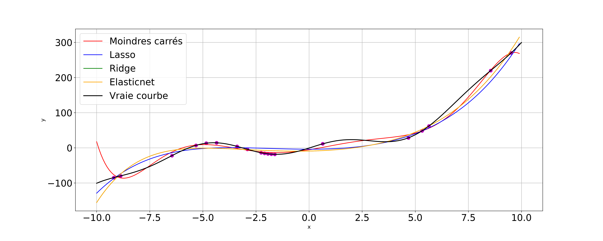
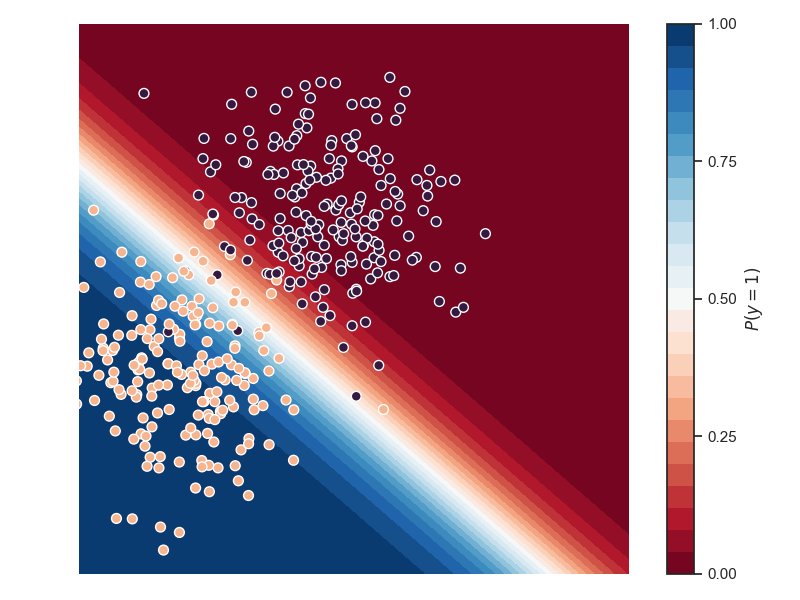
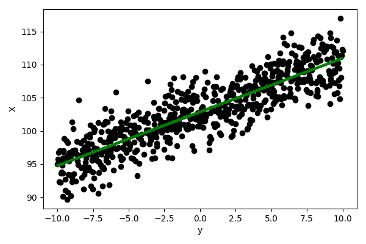
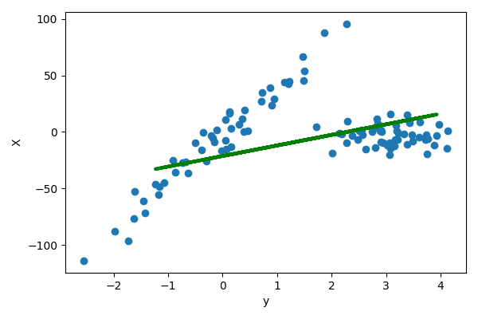
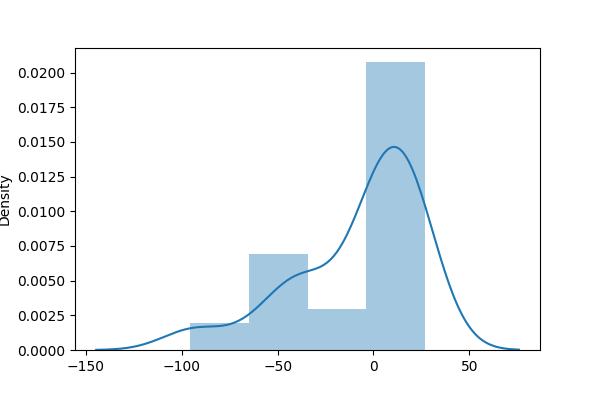
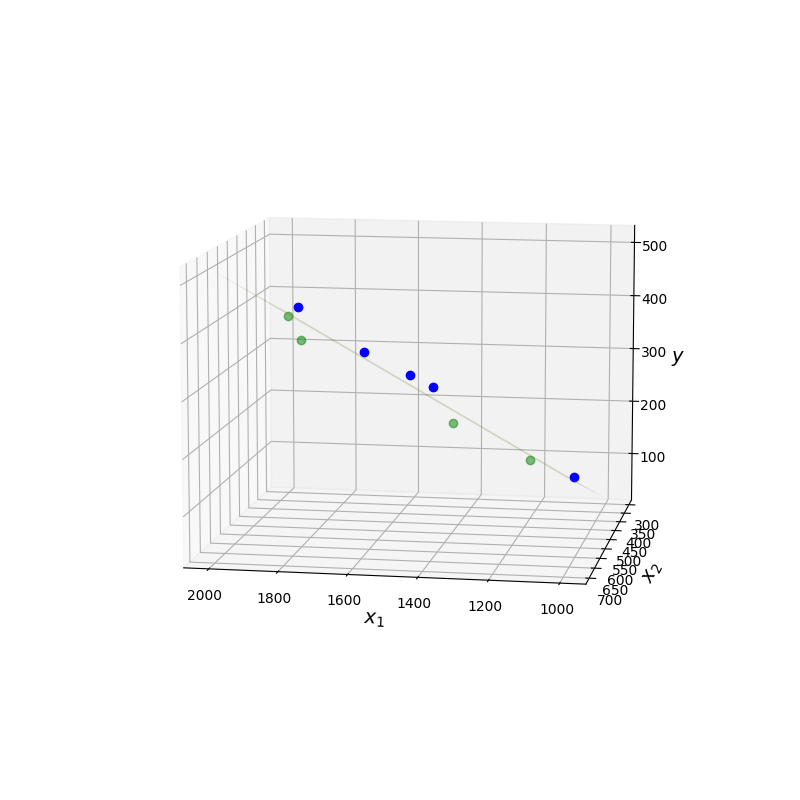
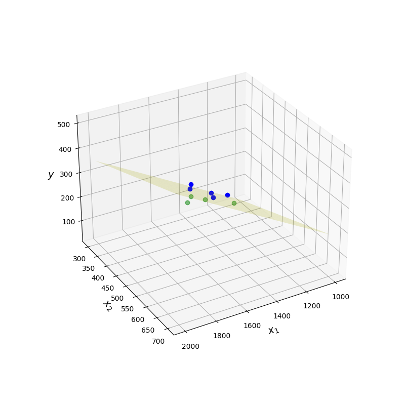

---
jupytext:
  formats: md:myst
  text_representation:
    extension: .md
    format_name: myst
kernelspec:
  display_name: Python 3
  language: python
  name: python3
---

# Régression

```{index} Régression
```
On s'intéresse ici à l'explication d'une variable (aléatoire) $Y$ (la variable expliquée) par une (ou plusieurs) variable(s) aléatoire(s) $X_j$ (prédicteurs, ou variables explicatives). 

## Régression simple
On dispose de $n$ couples de variables quantitatives $(\mathbf x_i,\mathbf y_i),i\in[\![1,n]\!]$ constituant un échantillon d'observations indépendantes de $(X,Y)$ et on cherche une relation statistique pouvant exister entre $Y$ et $X$. 
On rappelle ici quelques résultats élémentaires sur la régression linéaire simple.

### Modèle théorique
Théoriquement, on cherche une fonction $f$ telle que $f(X)$ soit aussi proche que possible de $Y$. Par proximité, on entend ici au sens des moindres carrés, et donc on cherche $f$ telle que $\mathbb{E}\left ( (Y-f(X))^2\right )$ soit minimale. On sait alors que la fonction $f$ qui satisfait cette propriété est :

$f(X) = \mathbb{E}(Y\mid X)$

````{prf:definition} Fonction de régression
La fonction $x\mapsto \mathbb{E}(Y\mid X=x)$ est la fonction de régression de $Y$ en $X$.
````

La qualité de l'approximation est mesurée par le rapport de corrélation.

```{index} Corrélation ; rapport
```

````{prf:definition} Rapport de corrélation
Le rapport de corrélation entre deux variables aléatoires $X$ et $Y$ est défini par le rapport entre la variation expliquée et la variation totale :

$\eta_{Y\mid X}^2 = \frac{\sigma_{\mathbb{E}(Y\mid X)}^2}{\sigma_Y^2}$
````

En pratique, $Y$ est approchée par $Y=\mathbb{E}(Y\mid X)+\varepsilon$, où $\varepsilon$ est un résidu aléatoire de moyenne nulle, non corrélé à $X$ et à $\mathbb{E}(Y\mid X)$ et tel que $\sigma_\varepsilon^2= (1-\eta_{Y\mid X}^2)\sigma_Y^2$.

Le cadre le plus utilisé est celui de la régression linéaire, c'est-à-dire lorsque $Y=a+bX+\varepsilon$ et donc $\mathbb{E}(Y\mid X)=a+bX$, ce qui est le cas lorsque $(X,Y)$ est un couple de variables aléatoires gaussiennes.

Puisque $\mathbb{E}(\varepsilon)=0$, la droite de régression passe par le point $(\mathbb{E}(X),\mathbb{E}(Y))$. Ainsi

$Y-\mathbb{E}(Y)=b(X-\mathbb{E}(X))+\varepsilon$

En multipliant par $X-\mathbb{E}(X)$ et en prenant l'espérance, on trouve à gauche la covariance de $(X,Y)$ et à droite la variance de $X$, soit

$\begin{array}{ccll}
\sigma_{XY}&=& b\sigma_X^2+\mathbb{E}(\varepsilon(X-\mathbb{E}(X)))&\\
&=& b\sigma_X^2 + \sigma_{\varepsilon X}&[\mathbb{E}(\varepsilon)=0]\\ 
&=& b\sigma_X^2 &[X\text{ et } \varepsilon\text{ non corrélés}]\\ 
\end{array}
$

d'où
$b = \frac{\sigma_{XY}}{\sigma_X^2} = r_{XY}\frac{\sigma_Y}{\sigma_X}$

L'équation de la droite de régression est donc finalement

$Y-\mathbb{E}(Y)=r_{XY}\frac{\sigma_Y}{\sigma_X}(X-\mathbb{E}(X))+\varepsilon$

En calculant la variance des deux termes, et puisque $\varepsilon$ et $X$ ne sont pas corrélés, on trouve 

$r_{XY}^2 = \eta_{Y\mid X}^2$

### Ajustement aux données
On cherche ici à ajuster le modèle linéaire théorique aux $n$ couples d'observations indépendantes $(\mathbf x_i,\mathbf y_i),i\in[\![1,n]\!]$. Il s'agit donc de trouver $a,b$ ainsi que la variance du résidu $\varepsilon$.

La méthode la plus classique est la méthode des moindres carrés : on cherche à ajuster au nuage de points  $(\mathbf x_i,\mathbf y_i),i\in[\![1,n]\!]$ une droite d'équation $y^*=\alpha +\beta x$ de sorte à minimiser 

$\displaystyle\sum_{i=1}^n (y_i^*-y_i)^2 = \displaystyle\sum_{i=1}^n (\alpha + \beta x_i-y_i)^2$

En annulant le gradient de cette fonction à deux variables $(\alpha,\beta)$, on trouve facilement 

$\beta = \frac{\sigma_{xy}}{\sigma_x^2} = r_{xy}\frac{\sigma_y}{\sigma_x}$

de sorte que $y^* = \bar y + r_{xy}\frac{\sigma_y}{\sigma_x}(x-\bar x)$.

La droite de régression linéaire passe donc par le centre de masse du nuage de points.
```{prf:remark}
:class: dropdown
les $x_i$ et $y_i$ étant des réalisations de variables aléatoires, tous les termes de l'équation de la droite de régression linéaire le sont également.
```

```{prf:remark}
:class: dropdown
On peut montrer que $\alpha$, $\beta$ et $y^*$ sont des estimateurs sans biais de $a$, $b$ et $\mathbb{E}(Y\mid X)$.
``` 
La figure suivante illustre la régression linéaire d'un ensemble de points, décomposé en un ensemble d'apprentissage (bleu) sur lequel la droite de régression a été apprise et un ensemble de test (vert) sur lequel les valeurs ont été prédites (magenta).




## Régression multiple
```{index} Régression ; multiple
```
### Ajustement linéaire d'un ensemble d'observations

La régression multiple généralise la régression simple au cas de $p\geq 2$ prédicteurs quantitatifs (ou variables explicatives). Ici on considère un échantillon de $n$ individus, sur lesquels $p+1$ variables sont mesurées : une variable à expliquer $\mathbf Y = (y_1\cdots y_n)^T\in\mathbb{R}^n$ et $p$ variables explicatives $\mathbf X_i$ linéairement indépendantes, mais possiblement en relation.

On cherche 

$\mathbf Y^* = \beta_0 \mathbf{1} + \displaystyle\sum_{i=1}^p \beta_i\mathbf X_i$

proche de $\mathbf Y$ au sens des moindres carrés. $\mathbf{1}$ est le vecteur de $\mathbb{R}^n$ dont toutes les composantes valent 1.

En notant 
$X = \begin{pmatrix}\mathbf{1} & \mathbf{X_1}\cdots \mathbf{X_p}\end{pmatrix}\in\mathcal{M}_{n,p+1}(\mathbb{R})\quad\text{et}\quad \boldsymbol{\beta}=(\beta_0\cdots \beta_p)^T
\in\mathbb{R}^{p+1}$

on a $\mathbf Y^*=\mathbf X\boldsymbol \beta$.


$\mathbf Y^*$ est par définition des moindres carrés la projection de $\mathbf Y$ sur $Im(\mathbf X)$, soit (Voir cours analyse numérique) :

$\mathbf Y^* = \mathbf X(\mathbf X^T\mathbf X)^{-1}\mathbf X^T \mathbf Y$

et donc 

$\boldsymbol\beta = (\mathbf X^T\mathbf X)^{-1}\mathbf X^T \mathbf Y$

et on a donc les paramètres de la régression multiple.


```{prf:remark}
:class: dropdown
Dans le cas où la métrique utilisée est définie par une matrice symétrique définie positive $D$ de taille $p$, alors 

$\boldsymbol\beta = (\mathbf X^T\mathbf D \mathbf X)^{-1}\mathbf X^T \mathbf D \mathbf Y$
```
### Modèle
On suppose que les $\mathbf X_i$ et $\mathbf Y$ sont $n$ réalisations indépendantes de $p+1$ variables aléatoires $\chi_i$ et $\omega$. De même qu'en régression simple, la recherche de la meilleure approximation de $\omega$ par une fonction des $\chi_i$ amène à $\mathbb{E}(\omega\mid \chi_1\cdots \chi_p)$ et l'hypothèse de régression multiple est

$\mathbb{E}(\omega\mid \chi_0\cdots \chi_p) = b_0+\displaystyle\sum_{i=1}^p b_i\chi_i+\varepsilon$

avec $\mathbb{E}(\varepsilon)=0, \sigma_\varepsilon=\sigma^2$ et $\varepsilon$ non corrélée aux $\chi_i$.

On peut montrer que $\boldsymbol\beta$ est un estimateur sans biais du vecteur aléatoire  $(b_0\cdots b_p)$, et en est la meilleure approximation. De plus, la meilleure estimation sans biais de la variance $\sigma^2$ est 

$\hat{\sigma}^2 = \frac{\|\mathbf Y -\mathbf Y^*\|^2}{n-p-1}$

## Modèle linéaire généralisé
### Position du problème
Dans le cas le plus général, on ne cherche pas à expliquer une seule variable mais $k\in\mathbb{N}$, obtenues par répétitions de l'expérience, les $\mathbf X_j$ restant identiques : pour $i\in[\![1,k]\!]$ $\mathbf{Y}_i\in\mathbb{R}^n$ est la $i^e$ observation. 

### Solution à partir des données
Le modèle fait l'hypothèse que le centre de gravité $\mathbf g$ des $k$ observations se situe dans $Im(\mathbf X)$, soit $\mathbf g = \mathbf X \boldsymbol \beta$
La plupart du temps, on ne connaît cependant qu'une seule des $k$ observations $\mathbf Y$, et le problème revient à approximer le mieux possible $\mathbf g$ en ne connaissant que $\mathbf Y$.

Cette approximation $\mathbf g^*$ s'exprime comme la projection orthogonale de $\mathbf Y$ sur $Im(\mathbf X)$, selon une métrique $\mathbf M$, à choisir de sorte que $\mathbf g^*$ soit la plus proche possible de $\mathbf g$. Dit autrement, en répétant la projection avec $\mathbf Y_1\cdots \mathbf Y_k$, les $k$ approximations $g^*_i=\mathbf X (\mathbf X^T\mathbf M\mathbf X)^{-1} \mathbf X^T \mathbf M \mathbf Y_i, i\in[\![1,k]\!]$ doivent être le plus concentrées possible autour de $\mathbf g$.

Ceci revient donc à trouver $\mathbf M$ de sorte à ce que l'inertie du nuage des $\mathbf g_i^*$ soit minimale. On montre (théorème de Gauss-Markov généralisé) que $\mathbf M=\mathbf V^{-1}$, où $\mathbf V$ est la matrice de variance-covariance du nuage des $\mathbf Y_i$. Ainsi, pour une seule observation, on en déduit 

$\begin{eqnarray*}
\mathbf g^*&=&\mathbf X(\mathbf X^T\mathbf V^{-1}\mathbf X)^{-1}\mathbf X^T\mathbf V^{-1}\mathbf Y\\
\boldsymbol \beta&=&(\mathbf X^T\mathbf V^{-1}\mathbf X)^{-1}\mathbf X^T\mathbf V^{-1}\mathbf Y
\end{eqnarray*}$


### Modèle
En ayant une infinité d'observations, on approche le modèle probabiliste. On suppose que $\mathbf Y$ est une réalisation d'un vecteur aléatoire d'espérance $\mathbf X\mathbf b$ et de matrice de variance-covariance $\boldsymbol\Sigma$. Le modèle s'écrit alors  $\mathbf Y=\mathbf X\mathbf b+\varepsilon$, avec $\varepsilon$ centré de variance $\boldsymbol\Sigma$, et le problème est donc d'estimer $\mathbf b$. On montre que  $\mathbf b = (\mathbf X^T \boldsymbol\Sigma^{-1}\mathbf X)^{-1}\mathbf X^T\boldsymbol\Sigma^{-1}\mathbf Y$, appelé estimation des moindres carrés généralisés est, sous des hypothèses larges, l'estimation de variance minimale de $\mathbf b$.

## Modèles régularisés
On peut montrer que l'estimateur des moindres carrés est de variance minimale parmi les estimateurs linéaires sans biais. Cependant, la variance aboutit dans certains cas à des erreurs de prédiction importantes. Dans ce cas, on cherche des estimateurs de variance plus petite quitte à avoir un (léger) biais. Pour ce faire, on peut supprimer l'effet de certaines variables explicatives ce qui revient à leur attribuer un poids nul.
Par ailleurs, dans le cas où $p$ est grand, l'interprétation des résultats obtenus est parfois complexe. Ainsi, on pourra préférer un modèle estimé avec moins de variables explicatives afin de privilégier l'interprétation plutôt que la précision.

Dans cette section, on s'intéresse à des méthodes permettant de produire des estimateurs dont les valeurs sont d'amplitudes réduites. On parle de modèles parcimonieux lorsque des variables ont des coefficients nuls. 

### Régression Ridge
```{index} Régression ; Ridge
```

```{index} Ridge regression
```
Dans l'approche moindres carrés linéaires classique, on cherche $\mathbf Y^* = \beta_0 \mathbf{1} + \displaystyle\sum_{i=1}^p \beta_i\mathbf X_i$ proche de $\mathbf Y$ au sens de la minimisation de $\|\mathbf Y^*-\mathbf Y\|^2 $. On cherche donc $\boldsymbol\beta_{mc}\in\mathbb{R}^{p+1}$ tel que :

$\boldsymbol\beta_{mc} = arg\displaystyle\min_{\boldsymbol\beta\in\mathbb{R}^{p+1}}\left [\displaystyle\sum_{i=1}^n \left (y_i-(\beta_0+\displaystyle\sum_{j=1}^p \beta_j x_{ij})\right )^2\right ]$

Dans l'approche Ridge regression (ou régression de Tikhonov), on pénalise l'amplitude des coefficients $\beta_j$. Pour ce faire, on pose $\boldsymbol\beta_{\setminus 0}$ le vecteur des $p$ dernières composantes de $\boldsymbol\beta$ et on cherche le vecteur $\boldsymbol\beta_r$ tel que

$\boldsymbol\beta_r = arg\displaystyle\min_{\boldsymbol\beta\in\mathbb{R}^{p+1}}\left [\displaystyle\sum_{i=1}^n \left (y_i-(\beta_0+\displaystyle\sum_{j=1}^p \beta_j x_{ij})\right )^2+\lambda \| \boldsymbol\beta_{\setminus 0}\|^2_2\right ]$

Le réel positif $\lambda$, pondérant  $\| \boldsymbol\beta_{\setminus 0}\|^2_2$ appelée fonction de pénalité, permet de réguler l'importance du second terme sur la minimisation. Un $\lambda$ grand impose à la minimisation d'avoir une amplitude faible des coefficients $\beta_j,j\in[\![1,p]\!]$, et une variance faible de l'estimateur de $\boldsymbol\beta$.

Contrairement à la régression linéaire multiple classique où les variables ne sont pas nécessairement normalisées, ici il est nécessaire de réduire les variables explicatives. En pratique on les centre également, et dans ce cas :

1. la première composante de $\boldsymbol\beta_r$ est prise égale à la moyenne empirique des $y_i$ avant centrage
2. les $p$ autres composantes de $\boldsymbol\beta_r$  sont obtenues par minimisation :  

$\hat{\boldsymbol \beta}_r = arg\displaystyle\min_{\mathbf v\in\mathbb{R}^{p}} \left ((\mathbf Y-\mathbf X\mathbf v)^T(\mathbf Y-\mathbf X\mathbf v) + \lambda \mathbf v^T\mathbf v\right )$

dont la solution analytique est $(\mathbf X^T\mathbf X + \lambda \mathbb{I})^{-1}\mathbf X^T\mathbf Y$.


Le choix de $\lambda$ n'est pas évident. La solution la plus simple consiste à prendre plusieurs valeurs, à tester les solutions proposées par ces valeurs et à retenir le $\lambda$ ayant obtenu le meilleur score (par exemple la précision sur un ensemble de test). De manière moins expérimentale, il existe des algorithmes (basés sur la décomposition en valeurs singulières) permettant de choisir une ''bonne'' valeur de paramètre.

### Régression Lasso

```{index} Régression ; Lasso
```

```{index} Lasso
```
La régression Lasso (Least Absolute Shrinkage and Selection Operator) est, dans son principe, très proche de la régression Ridge, la seule différence résidant dans la norme utilisée dans la fonction de pénalité : on cherche $\boldsymbol\beta$ minimisant

$\boldsymbol\beta_l = arg\displaystyle\min_{\boldsymbol\beta\in\mathbb{R}^{p+1}}\left [\displaystyle\sum_{i=1}^n \left (y_i-(\beta_0+\displaystyle\sum_{j=1}^p \beta_j x_{ij})\right )^2+\lambda \| \boldsymbol\beta_{\setminus 0}\|^2_1\right ]$

Contrairement à la régression Ridge, il n'y a pas de solution analytique (la norme $\ell_1$ rend la fonction non différentiable) et on doit donc recourir à des méthodes de résolution numérique. Lorsque $\lambda$ est grand, la minimisation force la fonction de pénalité à être petite : étant donné que cette dernière est une somme de valeurs absolues, la minimisation impose à certains coefficients $\beta_j,j\in[\![1,p]\!]$ d'être nuls. On parle alors de régression parcimonieuse (et la régression peut donc être vue comme une méthode de sélection de variables).

Quand $p>n$, la méthode ne sélectionne que $n$ variables. De plus, si plusieurs variables sont corrélées entre elles, Lasso ignore toutes sauf une. Et, pire, même si $n>p$, et s'il y a de fortes corrélations entre les variables explicatives, on trouve empiriquement que Ridge donne de meilleurs résultats que Lasso.

### Régression Elasticnet

```{index} Régression ; Elasticnet
```
```{index} Elasticnet
```
On suppose ici que $\mathbf X$ est centré réduit, et $\mathbf Y$ est centré (donc $\beta_0=0$). La régression Elasticnet est un mélange de Ridge et Lasso : on cherche $\boldsymbol\beta_e$ tel que

$\boldsymbol\beta_e = arg\displaystyle\min_{\boldsymbol\beta\in\mathbb{R}^{p}}\left [\displaystyle\sum_{i=1}^n \left (y_i-\displaystyle\sum_{j=1}^p \beta_j x_{ij}\right )^2+\lambda_1 \| \boldsymbol\beta\|^2_1 + \lambda_2 \| \boldsymbol\beta\|^2_2\right ]$

En notant $\lambda =\lambda_1+\lambda_2$ et $ \alpha = \lambda_1/\lambda$ on minimise alors 

$\displaystyle\sum_{i=1}^n \left (y_i-\displaystyle\sum_{j=1}^p \beta_j x_{ij}\right )^2+\lambda(\alpha \| \boldsymbol\beta\|^2_1 + (1-\alpha) \| \boldsymbol\beta\|^2_2)$

On montre alors que la solution de la régression Elasticnet peut être obtenue à l'aide de la solution de la régression Lasso.

````{prf:property} 

Soit $\mathbf X\in\mathcal{M}_{np}(\mathbb R)$ la matrice des variables explicatives, et $\mathbf Y\in\mathbb{R}^n$ le vecteur des valeurs de la variable expliquée. Soient $\lambda_1,\lambda_2\in\mathbb{R}^+$. On pose 

$\mathbf X^*\in\mathcal{M}_{(n+p)p}(\mathbb R) = \frac{1}{\sqrt{1+\lambda_2}}\begin{pmatrix}\mathbf X\\\sqrt{\lambda_2 }\mathbb{I}\end{pmatrix}\quad\text{et}\quad \mathbf Y^*=\begin{pmatrix}\mathbf Y\\0\end{pmatrix}$

et on note $\gamma=\lambda_1/(\lambda_1+\lambda_2)$. 

Alors la fonction objectif de la régression Elasticnet s'écrit $\|\mathbf Y^*-\mathbf X^*\boldsymbol\beta^*\|_2^2+\gamma\|\boldsymbol\beta^*\|_1$. 
Si $\hat{\boldsymbol\beta}$ minimise cette fonction, alors l'estimateur naïf de la régression Elasticnet est 

$\boldsymbol\beta_e = \frac{1}{\sqrt{1+\lambda_2}}\hat{\boldsymbol\beta}$
````

Puisque $\mathbf X^*$ est de rang $p$, la solution peut sélectionner $p$ variables contrairement à la régression Lasso.

En pratique, cet estimateur naïf ne donne satisfaction que lorsqu'il est proche de $\boldsymbol\beta_r$ ou de $\boldsymbol\beta_l$. On retient généralement l'estimateur rééchelonné $(1+\lambda_2)\boldsymbol\beta_e = \sqrt{1+\lambda_2}\hat{\boldsymbol\beta}$ (Elasticnet peut être vu comme un Lasso où la matrice de variance-covariance est proche de la matrice Identité, et on montre que le facteur $1+\lambda_2$ intervient alors).


La figure suivante compare les différentes méthodes de régression sur la fonction 

$f(x) = x-\frac35 x^2+\frac15x^3 + 18sin(x)$

avec $p=8$ et $n=20$. Les $n=20$ points  échantillonnés sur la courbe $y=f(x)$ sont utilisés pour faire la régression sur l'intervalle [-10,10].





Sur la figure suivante, les lignes de niveau de la fonction de coût du problème au moindres carrés sont représentées. La croix blanche représente la valeur optimale des paramètres du modèle, lorsque le problème n'est pas régularisé (moindres carrés linéaires). Les contraintes de régularisation sont les boules $\|\beta\|_x=c$ pour les trois régularisation et les solutions régularisées obtenues (valeur optimale des paramètres $\beta_l,\beta_r$ et $\beta_e$) sont les points jaunes.


## Régression logistique

```{index} Régression ; logistique
```
Dans les sections précédentes, nous n'avons pas abordé les cas où les prédicteurs exhibent des dépendances non linéaires ou lorsque la variable à prédire n'est pas quantitative.

La régression logistique est un modèle linéaire généralisé utilisé pour prédire une variable binaire, ou catégorielle, à partir de prédicteurs quantitatifs ou catégoriels. 

### Régression logistique binaire
Dans un premier temps, la variable à prédire est binaire : elle ne prend donc que deux valeurs 0/1 (ou -1/1). Dans le chapitre suivant, nous étudierons des algorithmes permettant d'aborder ce problème sous un angle classification. Ici, nous nous intéressons à une modélisation probabiliste, permettant notamment de prendre en compte le bruit dans les données. 

#### Modèle
On recherche une distribution conditionnelle $P(Y|X)$ de la variable à prédire sachant les prédicteurs. Si le problème est en 0/1, alors $Y$ est une variable indicatrice et on a $P(Y=1)=\mathbb{E}(Y)$ et $P(Y=1|X=x)=\mathbb{E}(Y|X=x)$. La probabilité conditionnelle est donc l'espérance conditionnelle de l'indicatrice.

Supposons que $P(Y=1|X=x)=p(x,\boldsymbol\theta)$ avec $p$ fonction paramétrée par $\boldsymbol\theta$. On suppose également que les observations sont indépendantes. La vraisemblance est alors donnée par

$\displaystyle\prod_{i=1}^n P(Y=y_i|X=x_i) = \displaystyle\prod_{i=1}^n p(x_i,\boldsymbol\theta)^{y_i}(1-p(x_i,\boldsymbol\theta))^{1-y_i}$


```{prf:remark}
:class: dropdown
Pour $n$ tirages d'une variable de Bernoulli dont la probabilité de succès est constante et vaut $p$, la vraisemblance est $\displaystyle\prod_{i=1}^n p^{y_i}(1-p)^{1-y_i}$. Cette vraisemblance est maximisée lorsque 
$p=n^{-1}\displaystyle\sum_{i=1}^n y_i$.
```

En notant $p_i=p(x_i,\boldsymbol\theta)$, maximiser la vraisemblance sans contrainte amène à la solution non informative $p_i=1$ si $y_i=1$ et 0 sinon. Si l'on essaye d'ajouter des contraintes (relations entre les $p_i$), alors l'estimation du maximum de vraisemblance devient difficile.

Ici le modèle  $p_i=p(x_i,\boldsymbol\theta)$ suppose que si $p$ est continue, alors des valeurs proches de $x_i$ amènent à des valeurs proches de $p_i$. En supposant $p$ connue comme fonction de $\boldsymbol\theta$, la vraisemblance est une fonction de $\boldsymbol\theta$ et on peut estimer ce paramètre en maximisant la vraisemblance.


#### Régression logistique
On recherche un ''bon'' modèle pour $p$ :

1. On peut dans un premier temps supposer que $p(\mathbf x)$ est une fonction linéaire de $\mathbf x$. Les fonctions linéaires étant non bornées, elles ne peuvent modéliser des probabilités.  
2. On peut alors supposer que $log\ p(\mathbf x)$ est une fonction linéaire de $\mathbf x$. Là aussi, la fonction logarithme est non bornée supérieurement, et ne peut modéliser une probabilité.
3. Partant de cette idée, on borne le logarithme en utilisant la transformation logistique (ou logit) $log\frac{p(\mathbf x)}{1-p(\mathbf x)}$. Etant donné un événement ayant une probabilité $p$ de réussir, le rapport $p/(1-p)$ est appelé la côte de l'événement (rapport de la probabilité qu'il se produise sur celle qu'il ne se produise pas. Si vous avez $p$=3/4 de chances de réussir à votre examen de permis, cotre côte est $p/(1-p)=\frac{3/4}{1/4}$=3 contre un). On peut alors supposer que cette fonction de $p$ est linéaire en $\mathbf x$.


Le modèle de régression logistique s'écrit alors formellement 

$logit(p(\mathbf x)) = log \frac{p(\mathbf x)}{1-p(\mathbf x)} = \beta_0\mathbf 1 + \boldsymbol\beta\mathbf x$

En résolvant par rapport à $p$ on trouve alors 

$p(\mathbf x,\boldsymbol\theta) = \frac{e^{\beta_0\mathbf 1 + \boldsymbol\beta\mathbf x}}{1+e^{\beta_0\mathbf 1 + \boldsymbol\beta\mathbf x}}=\frac{1}{1+e^{-(\beta_0\mathbf 1 + \boldsymbol\beta\mathbf x)}}\quad\text{avec }\boldsymbol\theta=(\beta_0,\boldsymbol\beta)^T$


Pour minimiser les erreurs de prédiction, on doit prédire $Y=1$ si $p\geq 0.5$, soit $\beta_0\mathbf 1 + \boldsymbol\beta\mathbf x\geq 0$ et $Y=0$ sinon. La régression logistique est donc un classifieur linéaire, dont la frontière de décision est justement l'hyperplan $\beta_0\mathbf 1 + \boldsymbol\beta\mathbf x= 0$. On peut montrer que la distance de $\mathbf x$ à cet hyperplan est $\beta_0/\|\boldsymbol\beta\| + \mathbf x^T\boldsymbol\beta/\|\boldsymbol\beta\|$. Les probabilités d'appartenance de $\mathbf x$ aux classes décroissent donc d'autant plus vite que $\|\boldsymbol\beta\|$ est grand.

Dans la figure suivante, la probabilité d'appartenance à la classe 1 (points rouges) est donnée en fausses couleurs.



 

### Régression logistique à plusieurs classes
Dans ce cas, $Y$ peut prendre $k$ valeurs. Le modèle reste le même, chaque classe $c\in[\![0,k-1]\!]$ ayant son jeu de paramètres $\boldsymbol\theta_c=(\beta^c_0,\boldsymbol\beta^c)^T$. Les probabilités conditionnelles prédites sont alors 

$(\forall c\in[\![0,k-1]\!])\;\;P(Y=c|X=\mathbf x) = \frac{e^{\beta^c_0\mathbf 1 + \boldsymbol\beta^c\mathbf x}}{1+e^{\beta^c_0\mathbf 1 + \boldsymbol\beta^c\mathbf x}}$


### Interprétation
Si $\mathbf x=\mathbf 0$, alors $p(\mathbf x)=\frac{1}{1+e^{-\beta_0}}$. L'ordonnée à l'origine fixe donc le taux d'événements "de base". 

Supposons $\boldsymbol\beta\in\mathbb{R}$ (l'interprétation sera la même dans le cas général). Considérons l'effet sur la probabilité d'un évènement du changement de $x\in\mathbb{R}$ d'une unité, passant de $x_0$ à $x_0+1$. Alors :

$logit(p(x_0+1))-logit(p(x_0)) = \beta_0+\beta(x_0+1)-(\beta_0+\beta(x_0)) = \beta$
et en utilisant la définition de la fonction logit :

$\begin{eqnarray*}
log \frac{p( x_0+1)}{1-p(x_0+1)}-log \frac{p( x_0)}{1-p(x_0)} &=& \beta\\
log \left  [\frac{\frac{p( x_0+1)}{1-p(x_0+1)}}{\frac{p( x_0)}{1-p(x_0)}} \right ]&=& \beta\\
\end{eqnarray*}$

En notant OR (Odds Ratio, ou rapport de côte) le terme en argument du log, et en prenant l'exponentielle, on trouve $OR=e^\beta$. Le coefficient $\beta$ est donc tel que $e^\beta$ est le rapport de côte pour un changement unitaire de l'entrée $x$. Si $x$ est incrémenté de deux unités, alors le rapport de côte est de $e^{2\beta}=(e^\beta)^2$, que l'on généralise facilement au cas d'un changement de $n$ unités à OR=$(e^\beta)^n$. 

Dans le cas où $\boldsymbol\beta$ est un vecteur, sa ième composante est une estimation du changement de la probabilité d'un évènement correspondant à une augmentation d'une unité de la ième composante de $\mathbf x$, les autres composantes étant constantes.

### Estimation des coefficients de la régression logistique
D'après le modèle probabiliste, la distribution associée à la régression logistique est la loi binomiale. Pour $n$ échantillons $(x_i,y_i),i\in[\![1,n]\!]$, la vraisemblance s'écrit 

$\displaystyle\prod_{i=1}^n p(x_i,\boldsymbol\theta)^{y_i}(1-p(x_i,\boldsymbol\theta))^{1-y_i}$

Pour estimer les paramètres $\beta_0$ et $\boldsymbol\beta$ à partir des données, on maximise cette vraisemblance. On prend son logarithme, on calcule son gradient et on en déduit un système d'équations à résoudre. Cette approche amène à des calculs complexes, la formulation analytique n'étant pas simple, et une approximation numérique est en pratique mise en oeuvre pour trouver l'optimal.

## Analyse des résultats d'une régression
### Etude des résidus
L'étude des résidus $ y_i- y^*_i$ permet de repérer les observations aberrantes ou au contraire qui jouent un rôle fondamental dans la détermination de la régression. Elle permet également de vérifier que  le modèle linéaire est justifié.

Comme $\mathbf Y = \mathbf Y -\mathbf X\boldsymbol \beta +\mathbf X\boldsymbol \beta$ , où $\mathbf Y-\mathbf X\boldsymbol \beta $ est orthogonal à $\mathbf X\boldsymbol \beta$, la matrice de variance des résidus s'écrit 

$\begin{eqnarray*}
\mathbb{V}(\mathbf Y) &=& \mathbb{V}(\mathbf Y-\mathbf X\boldsymbol \beta)+\mathbb{V}(\mathbf X\boldsymbol \beta)\\
\sigma^2 \mathbf{I} &=&\mathbb{V}(\mathbf Y-\mathbf X\boldsymbol \beta)+ \sigma^2 \mathbf X(\mathbf X^T\mathbf X)^{-1}\mathbf X^T\\ 
\text {soit }\mathbb{V}(\mathbf Y-\mathbf X\boldsymbol \beta)&=&\sigma^2(\mathbf{I}-\mathbf X(\mathbf X^T\mathbf X)^{-1}\mathbf X^T)
\end{eqnarray*}
$

et les résidus sont donc en général corrélés entre eux.

```{prf:remark}
:class: dropdown
$\mathbf{I}-\mathbf X(\mathbf X^T\mathbf X)^{-1}\mathbf X^T$ est la projection orthogonale sur $Im(\mathbf X)^\perp$
```

Si $p_i$ est le $i^e$ terme diagonal du projecteur $\mathbf X(\mathbf X^T\mathbf X)^{-1}\mathbf X^T$, alors 

$\mathbb{V}( y_i- y^*_i) = (1-p_i)\sigma^2$

d'où l'estimation de la variance du résidu $\hat{\mathbb{V}}(y_i-y^*_i) = (1-p_i)\hat{\sigma}^2$.

Si le modèle linéaire est justifié, alors la distribution des résidus suit approximativement une loi normale. Un test statistique (par exemple le test de Jarque-Berra) viendra confirmer ou infirmer l'hypothèse selon laquelle la distribution peut être considérée comme telle.


|  |  |
|------------------------------------------------------------|----------------------------------------------------------------|
|   |    |


```{index} Résidu ; studentisé
```

````{prf:definition} Résidu studentisé
On appelle résidu studentisé la quantité $\frac{y_i-y^*_i}{\hat{\sigma}\sqrt{1-p_i}}$
```` 

 Lorsque $n$ est grand, ces résidus doivent être compris dans l'intervalle [-2,2]. 


 Un fort résidu peut indiquer une valeur aberrante, mais la réciproque n'est pas vraie. Il est donc nécessaire d'étudier l'influence de chaque observation sur les résultats.

### Influence des observations
 Pour étudier l'influence des observations sur la prédiction, deux approches sont possibles (et complémentaires) : 

1. étudier l'influence d'une observation sur sa propre prédiction. On calcule le résidu prédit $y_i-y_{\bar{i}}^*$, où $y_{\bar{i}}^*$ est la prévision obtenue avec les $n-1$ autres observations que $y_i$. Il est facile de montrer que ce résidu vaut $\frac{y_i-y_i^*}{1-p_i}$

```{prf:remark}
:class: dropdown
Il convient de rester prudent lorsque $p_i$ est grand, et la quantité 
 $\displaystyle\sum_{i=1}^n  \frac{(y_i-y_i^*)^2}{(1-p_i)^2}$
 est une mesure du pouvoir prédictif du modèle.
 ``` 
2. étudier l'influence d'une observation sur les estimations des paramètres de la régression $\beta_i$. On peut par exemple calculer une distance, dite de Cook, entre $\boldsymbol \beta$ et $\boldsymbol \beta_{\bar{i}}$ :

 $$d(\boldsymbol \beta,\boldsymbol\beta_{\bar{i}}) = \frac{(\boldsymbol \beta-\boldsymbol\beta_{\bar{i}})^T\mathbf X^T \mathbf X(\boldsymbol \beta-\boldsymbol\beta_{\bar{i}})}{\hat{\sigma}^2(p+1)}=\frac{\|\mathbf Y^*-\mathbf Y_{\bar{i}}^*\|^2}{\hat{\sigma}^2(p+1)}$$

 où $\mathbf Y_{\bar{i}}^*=\mathbf X\boldsymbol\beta_{\bar{i}}$. Si $d(\boldsymbol \beta,\boldsymbol\beta_{\bar{i}})>1$, alors en général l'observation $i$ a une influence anormale.


### Stabilité des coefficients de régression
 La source principale d'instabilité dans l'estimation des paramètres de régression réside dans le fait que les variables explicatives sont très corrélées entre elles. Comme $\mathbb{V}(\boldsymbol \beta)=\sigma^2(\mathbf X^T\mathbf X)^{-1}$ alors si les $\mathbf X_i$ sont corrélés, la matrice $\mathbf X^T\mathbf X$ est mal conditionnée. Dans ce cas, les paramètres sont estimés avec imprécision et les prédictions sont entâchées d'erreur. Il est donc essentiel de mesurer les colinéarités entre prédicteurs. Par simplicité (sans que cela nuise à la généralité), on suppose ici que les variables sont centrées et réduites : $(\mathbf X^T\mathbf X)$ est donc une matrice de taille $p$ (le fait de centrer les données supprime la constante) et $\boldsymbol\beta\in\mathbb{R}^p$. Ainsi $(\mathbf X^T\mathbf X)=n\mathbf R$ où $\mathbf R$ est la matrice de corrélation entre les prédicteurs.

 Deux stratégies sont classiquement proposées : 

1. Facteur d'inflation de la variance : on a $\mathbb{V}(\boldsymbol \beta) = \sigma^2\frac{\mathbf{R}^{-1}}{n}$ et $\sigma^2_{\beta_j} = \frac{\sigma^2}{n}(\mathbf{R}^{-1})_{jj}$. Or le $j^e$ terme de $\mathbf{R}^{-1}$ est $\frac{1}{1-R^2_j}$ où $R^2_j$ est le carré du coefficient de corrélation multiple de $\mathbf X_j$ et des $p-1$ autres variables explicatives. Ce terme est le facteur d'inflation de la variance. La moyenne de ces $p$ termes est parfois utilisée comme indice global de colinéarité multiple.

```{prf:remark}
:class: dropdown
 Si les variables explicatives sont orthogonales, la régression multiple revient à $p$ régressions simples.
```
2. La factorisation spectrale de $\mathbf R$ s'écrit $\mathbf R = \mathbf U\boldsymbol\Lambda \mathbf U^T$. Donc $\mathbf{R}^{-1}=\mathbf U\Lambda^{-1}\mathbf U^T$ et la variance de $\beta_j$ s'écrit

 $\mathbb{V}(\beta_j) = \frac{\sigma^2}{n}\displaystyle\sum_{i=1}^p \frac{u_{ji}^2}{\lambda_i}$

 et dépend donc des inverses des valeurs propres de $\mathbf R$. Dans le cas où les prédicteurs sont fortement corrélés, les dernières valeurs propres sont proches de 0 ce qui entraîne l'instabilité des paramètres de régression.

 Pour améliorer la stabilité des paramètres de régression, on peut alors :

- rejeter certains termes de la somme précédente, par exemple en remplaçant les $p$ prédicteurs par leurs $p$ composantes principales (Ceci revient à effectuer $p$ régressions simples).
- régulariser la régression en utilisant des approche de type Ridge regression.


## Sélection des variables
 Plutôt que d'expliquer $\mathbf Y$ par l'ensemble des prédicteurs, on peut chercher un sous-ensemble de ces $p$ variables permettant d'obtenir quasiment le même résultat (régression). Nous avons déjà abordé la sélection de variables dans un chapitre précédent.


## Exemple
### Données
On s'intéresse aux données suivantes et on cherche s'il existe une relation entre la production $Y$ et les deux variables prédictives $X_1$ et $X_2$.


| Usine | Travail (h) $X_1$ | Capital (machines/h) $X_2$ | Production ($10^2$ T) |
|-------|-------------------|----------------------------|-----------------------|
| 1     | 1100              | 300                        | 60                    |
| 2     | 1200              | 400                        | 120                   |
| 3     | 1430              | 420                        | 190                   |
| 4     | 1500              | 400                        | 250                   |
| 5     | 1520              | 510                        | 300                   |
| 6     | 1620              | 590                        | 360                   |
| 7     | 1800              | 600                        | 380                   |
| 8     | 1820              | 630                        | 430                   |
| 9     | 1800              | 610                        | 440                   |


### Modèle
On fait l'hypothèse d'un modèle linéaire 

$y = \beta_0+\beta_1 X_1 + \beta_2 X_2+\varepsilon = \mathbf X \boldsymbol\beta+\boldsymbol\varepsilon$

On a alors $\boldsymbol\beta = (\mathbf X^T\mathbf X)^{-1}\mathbf X^T \mathbf Y = \begin{pmatrix} -437.714\\0.336\\0.410\end{pmatrix}$ et l'équation du modèle linéaire (hyperplan) aux moindres carrés est 

$y = -437.714+0.336 X_1+0.41X_2$

De plus
$\hat{\sigma}^2 = \frac{\|\mathbf Y -\mathbf Y^*\|^2}{n-p-1} = \frac{3194}{6} = 639$

de sorte que la covariance des paramètres de régression vaut

$\hat{\sigma}^2 (\mathbf X^T\mathbf X)^{-1} = \begin{pmatrix} 3355.56 & -4.152 & 6.184\\-4.152 & 0.008 & -0.016 \\ 6.184 & -0.016 & 0.038\end{pmatrix}$

Dans la figure suivante, les points au-dessus du plan regresseur sont en bleu, les autres en vert.


|  |  |
|------------------------------------------------------------|----------------------------------------------------------------|
| Un point de vue...  | Un autre   |


